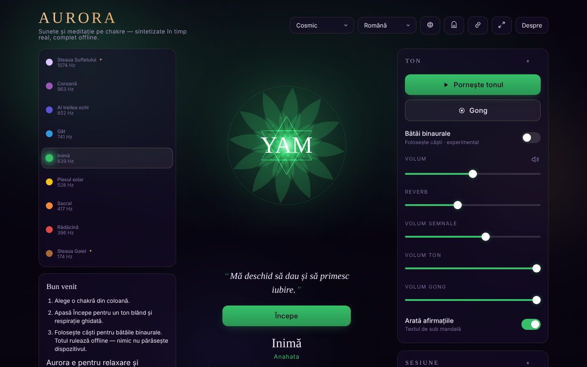

# Aurora

Chakra Sound & Meditation — tonuri, bătăi binaurale, ghid de respirație și călătorie prin chakre, într-un singur fișier HTML.

**Live:** https://chiuta.github.io/Aurora/

## Ce este

Aurora este un instrument contemplativ de sunet și meditație: alegi o chakră, iar aplicația generează în browser un ton (Web Audio API) cu frecvența asociată, o mandala animată, opțional bătăi binaurale, gong, clopoțel la interval și un ghid de respirație. Aplicația precizează în interfață că este pentru relaxare și contemplare, iar frecvențele și chakrele provin din tradiții spirituale, nu din medicină.

## Funcții

- Selecție de chakre cu informații despre frecvență, element, mantră, petale, solfeggio, „sense” și ton.
- Generare de ton, reglaj de volum, reverb, volume separate pentru indicații, ton și gong; gong la cerere.
- Bătăi binaurale (recomandat cu căști), cu presetări Delta 2 Hz, Theta 6 Hz, Alpha 10 Hz și altele.
- Sesiune cu durată setabilă; „Chakra journey” (călătorie automată prin chakre), opțiuni: echilibrare automată, includere transpersonală (9 chakre în loc de 7), parcurgere descendentă (de la coroană la rădăcină), clopoțel la interval.
- Ghid de respirație cu modele selectabile și indicații la schimbarea fazelor.
- Afirmații afișate sub mandala (opțional), mod simplu (ascunde controalele avansate), mod zen/ecran complet, ecran care rămâne aprins (Wake Lock, unde este suportat).
- Istoric al sesiunilor recente, presetări, temă.
- Fereastră „Gateway practices”, fereastră de scurtături și tutorial de respirație.
- Export / import / resetare a setărilor (fișier JSON).
- Interfață în 9 limbi: engleză, română, spaniolă, franceză, italiană, portugheză, catalană, hindi, arabă.

## Manual de utilizare

1. Deschide pagina și citește nota inițială; apasă „Got it” (sau echivalentul în limba aleasă). La prima rulare apare un ghid de întâmpinare („Welcome” / „Begin”).
2. Alege limba cu butonul de limbă din antet sau apasă `L` pentru a trece la următoarea.
3. Selectează o chakră (săgeți Sus/Jos schimbă chakra).
4. Apasă Spațiu pentru a porni/opri tonul; `G` lovește gongul.
5. Reglează volumul cu `+` / `-` sau din controalele „Volume”, „Reverb”, „Tone volume”, „Gong volume”.
6. Pentru bătăi binaurale, deschide secțiunea „Binaural beats”, alege „Beat” și folosește căști.
7. Pentru respirație, alege un model din „Breathing”; `B` trece la modelul următor; `?` deschide ghidul de respirație.
8. În „Session” setează „Duration” și, dacă dorești, „Chakra journey”.
9. Escape închide ferestrele și iese din modul zen.
10. Salvarea datelor: „Export settings” descarcă `aurora-settings.json`; „Import settings” îl reîncarcă; „Reset to defaults” revine la valorile implicite.

## Confidențialitate și rețea

- **Stocare locală:** `localStorage`, toate cheile cu prefixul `aurora.` (limbă, temă, volume, preferințe de sesiune, presetări, istoric, marcaje că notele au fost văzute). Dacă stocarea este blocată, aplicația afișează un avertisment.
- **Rețea:** în codul aplicației nu există `fetch`, CDN, scripturi sau resurse externe încărcate automat; nu am găsit analytics. Sunetul este sintetizat local.
- Aplicația conține o referință text către Centrul AmaneSer (amaneser.ro) în nota „About”, fără încărcare de resurse de acolo.

## Rulare locală / offline

Descarcă `index.html` și deschide-l în browser. Nu necesită internet pentru funcționare. Nu este nevoie de server.

## Licență

Licența nu este încă declarată explicit în acest repository; vezi nota din aplicație.

## Autor

Alexio — Alexandru-Ionuț Chiuță, contact: alexio@trom.tf

## English summary

Aurora is a single-file chakra sound and meditation tool: synthesized tones (Web Audio), binaural beats, gong, breathing guide, automatic chakra journey, session history, settings export/import and a 9-language UI. Preferences are kept in localStorage under the `aurora.` prefix; the app makes no network requests. It is for relaxation, not medicine.
